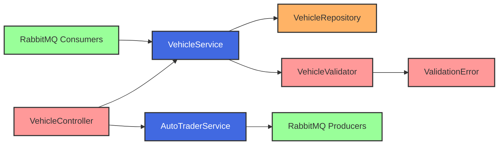

# Vehicle Inventory Management System

## Overview 🚗
A microservice designed to manage a vehicle inventory system with real-time synchronization to AutoTrader. This service helps dealerships manage their vehicle listings efficiently while ensuring data consistency across platforms. Built using Spring Boot, it implements a Chain of Responsibility pattern for validation and uses RabbitMQ for asynchronous communication with AutoTrader.

## Features ✨
- **Vehicle Management**: Add, update, delete, and view vehicles in inventory.
- **Data Validation**:
    - Comprehensive validation using the Chain of Responsibility pattern.
    - VIN number format and uniqueness validation.
    - Price range and business rule validation.
    - Aggregate error collection and detailed error responses.
- **AutoTrader Integration**:
    - Automatic synchronization of vehicle listings with AutoTrader.
    - Async message processing for better performance.
    - Retry mechanism for failed syncs.
- **Real-time Updates**:
    - RabbitMQ for reliable message processing.
    - Event-driven architecture for system updates.
    - Async status tracking and updates.
- **Error Handling**:
    - Robust error handling with detailed validation messages.
    - Custom exception handling for business rules.
    - Graceful degradation when AutoTrader is unavailable.

## Technology Stack 🛠️

### Core
- Java 17
- Spring Boot 3.x
- Spring Web
- Spring Data JPA
- Spring AMQP
- PostgreSQL
- UUID support for identifiers
- JSON type support for complex data

### Messaging
- RabbitMQ
- Dead Letter Queues for failed messages
- Message persistence
- Retry policies

### Database Management
- Liquibase
- Version-controlled database schema
- Rollback support
- Test data management
- Database migration scripts

### Testing
- JUnit 5
- Nested test organization
- Integration tests with test containers
- Testcontainers
- PostgreSQL container
- RabbitMQ container
- AssertJ for fluent assertions

### Build Tools
- Gradle
- Multi-project build support
- Dependency management
- Test execution
- Docker
- Containerized development environment
- Production-ready images
- Docker Compose for local development

## Architecture Overview 🏗️
```plaintext
inventory-service/
├── controllers
│   ├── VehicleController (REST endpoints)
│   └── advice (Global exception handling)
├── services
│   ├── VehicleService (Core business logic)
│   └── AutoTraderService (External integration)
├── validators
│   ├── BaseValidator (Chain of Responsibility base)
│   ├── VehicleValidator
│   └── ValidationError (Error aggregation)
├── models
│   ├── Vehicle (Domain entity)
│   ├── VehicleStatus (Enum)
│   └── sync (Sync-related models)
├── messaging
│   ├── consumers (RabbitMQ listeners)
│   └── producers (Message publishers)
├── config
│   ├── RabbitConfig
│   └── ValidationConfig
└── repository
   └── VehicleRepository
  ```




## System Flow

### Vehicle Creation and Sync Flow
```mermaid
sequenceDiagram
    participant Client
    participant Controller
    participant Validator
    participant Service
    participant Database
    participant RabbitMQ
    participant AutoTrader

    Client->>Controller: POST /vehicles
    Controller->>Validator: Validate Vehicle
    
    alt Invalid Data
        Validator-->>Controller: Validation Errors
        Controller-->>Client: 400 Bad Request
    else Valid Data
        Validator-->>Controller: Success
        Controller->>Service: Create Vehicle
        Service->>Database: Save Vehicle
        Database-->>Service: Vehicle Saved
        Service->>RabbitMQ: Publish Sync Event
        Service-->>Controller: Return Vehicle
        Controller-->>Client: 201 CREATED        
        RabbitMQ->>Service: Process Sync Event
        Service->>AutoTrader: Create Listing
        AutoTrader-->>Service: Listing Created
        Service->>Database: Update Sync Status
    end